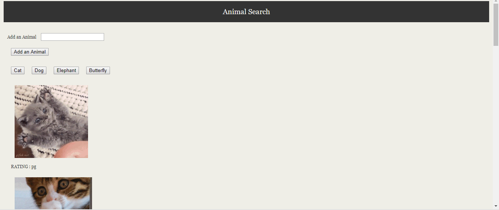

# Name of project

Giphy: The webpage allows you to add new animals to page.  If you click on an animal, it will use the giphy to add animals to the website.  Additionally if you click on an image it will set it to still and animate.  

# Link to the site

[Giphy Game](https://ztabbasi.github.io/giffy/)

# Images

# Technologies used

HTML
CSS
Javascript
Jquery
AJAX

# code snippets

        $.ajax({
          url: queryURL,
          method: "GET"
        }).then(function (response) {
          // console.log("I am here in ajax", response);
          for (var i = 0; i < 10; i++) {
            // Creating a div to hold the animal
            var animalDiv = $("
");
// <!-- 
//             console.log("hello", response.data[i].images.downsized.url); -->
            //console.log("hello", response.data[i].images.fixed_height_still.url);

            // Retrieving the URL for the image
            var imgActive = response.data[i].images.fixed_height.url;
            var imgStill = response.data[i].images.fixed_height_still.url;
            // Creating an element to hold the image
            var image = $("");
 
Above code makes an AJAX call using the Gipphy API to get images of the animal clicked.
And then adds 10 images to the webpage.

# Author 
Zia Abbasi

# License
Standard MIT License
